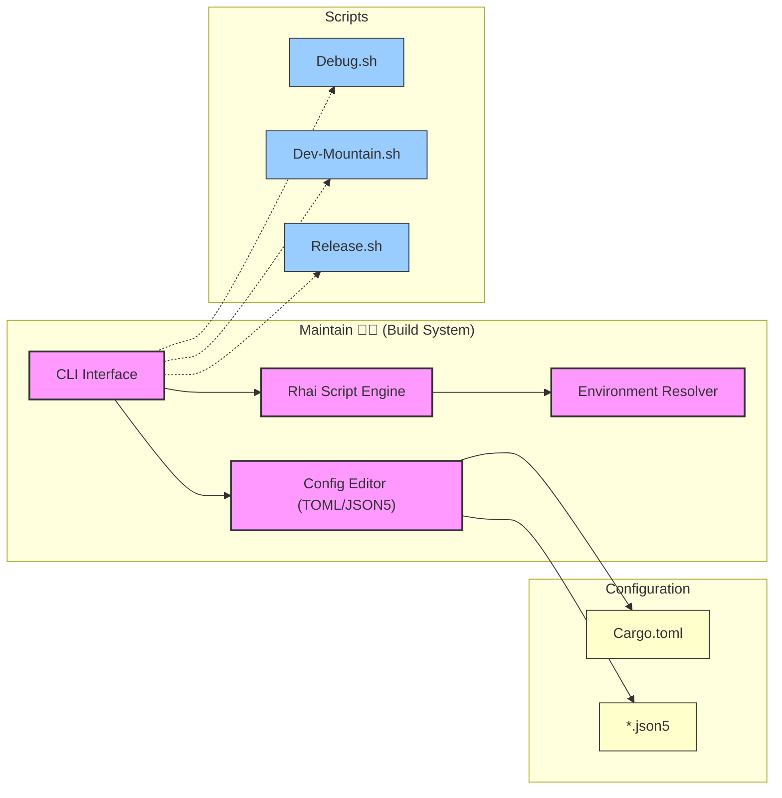

<table>
<tr>
<td align="left" valign="middle">
<h3 align="left"> Maintain</h3>
</td>
<td align="left" valign="middle">
<h3 align="left">
💪🏻
</h3>
</td>
<td align="left" valign="middle">
<h3 align="left"> + </h3>
</td>
<td align="left" valign="middle">
<h3 align="left">
<a href="https://Editor.Land" target="_blank">
<picture>
<source media="(prefers-color-scheme: dark)" srcset="https://PlayForm.Cloud/Dark/Image/GitHub/Land.svg">
<source media="(prefers-color-scheme: light)" srcset="https://PlayForm.Cloud/Image/GitHub/Land.svg">

</picture>
</a>
</h3>
</td>
<td align="left" valign="middle">
<h3 align="left">
<a href="https://Editor.Land" target="_blank">
Land
</a>
</h3>
</td>
<td align="left" valign="middle">
<h3 align="left">
🏞️
</h3>
</td>
</tr>
</table>

---

# **Maintain**&#x2001;💪🏻

> **Build pipelines that change behavior based on environment variables, implicit tool versions, or undeclared dependencies make debugging production issues impossible. The same commit produces different output on different machines.**

_"Deterministic builds. Same commit, same output, guaranteed."_

Maintain builds the entire Land ecosystem with Rhai scripting for flexible build logic, compile-time validated TOML and JSON5 configurations, and deterministic artifact generation. GritQL queries handle automated refactoring across the codebase. The same commit always produces the same output across all machines.

📖 **[Rust API Documentation](https://Rust.Documentation.Maintain.Editor.Land/)**

---

## What It Does&#x2001;🔐

- **Rhai scripting.** Flexible build logic without shell script fragility.
- **Deterministic output.** Same commit, same artifacts, across all machines and CI environments.
- **GritQL refactoring.** Automated codebase-wide refactoring with structural pattern matching.
- **Compile-time config.** TOML and JSON5 configurations validated at build time.

---

## In the Ecosystem&#x2001;💪🏻 + 🏞️

---

## Development&#x2001;🛠️

Maintain is a component of the Land workspace. Follow the
[Land Repository](https://github.com/CodeEditorLand/Land) instructions to
build and run.

---

## License&#x2001;⚖️

CC0 1.0 Universal. Public domain. No restrictions.
[LICENSE](https://github.com/CodeEditorLand/Maintain/tree/Current/LICENSE)

---

## See Also

- [Maintain Documentation](https://editor.land/Doc/maintain)
- [Architecture Overview](https://editor.land/Doc/architecture)
- [Why Rust](https://editor.land/Doc/why-rust)
- [Mountain](https://github.com/CodeEditorLand/Mountain)
- [Rest](https://github.com/CodeEditorLand/Rest)
- [Output](https://github.com/CodeEditorLand/Output)

## Funding & Acknowledgements 🙏🏻

Code Editor Land is funded through the NGI0 Commons Fund, established by NLnet
with financial support from the European Commission's Next Generation Internet
programme, under grant agreement No. 101135429.

The project is operated by PlayForm, based in Sofia, Bulgaria.

PlayForm acts as the open-source steward for Code Editor Land under the NGI0
Commons Fund grant.

<table>
	<thead>
		<tr>
			<th align="left"><strong>Land</strong></th>
			<th align="left"><strong>PlayForm</strong></th>
			<th align="left"><strong>NLnet</strong></th>
			<th align="left"><strong>NGI0 Commons Fund</strong></th>
		</tr>
	</thead>
	<tbody>
		<tr>
			<td align="left" valign="middle">
				
			</td>
			<td align="left" valign="middle">
				
			</td>
			<td align="left" valign="middle">
				
			</td>
			<td align="left" valign="middle">
				
			</td>
		</tr>
	</tbody>
</table>

---

**Project Maintainers**: Source Open
([Source/Open@Editor.Land](mailto:Source/Open@Editor.Land)) |
[GitHub Repository](https://github.com/CodeEditorLand/Maintain) |
[Report an Issue](https://github.com/CodeEditorLand/Maintain/issues) |
[Security Policy](https://github.com/CodeEditorLand/Maintain/security/policy)
