# **Maintain**&#x2001;🔧

<table>
	<tr>
		<td>
			<a href="https://GitHub.Com/CodeEditorLand/Maintain" target="_blank">
				<picture>
					<source media="(prefers-color-scheme: dark)" srcset="https://img.shields.io/github/last-commit/CodeEditorLand/Maintain?label=Last-commit&color=black&labelColor=black&logoColor=white&logoWidth=0" />
					<source media="(prefers-color-scheme: light)" srcset="https://img.shields.io/github/last-commit/CodeEditorLand/Maintain?label=Last-commit&color=white&labelColor=white&logoColor=black&logoWidth=0" />
					
				</picture>
			</a>
			<br />
			<a href="https://GitHub.Com/CodeEditorLand/Maintain" target="_blank">
				<picture>
					<source media="(prefers-color-scheme: dark)" srcset="https://img.shields.io/github/issues/CodeEditorLand/Maintain?label=Issues&color=black&labelColor=black&logoColor=white&logoWidth=0" />
					<source media="(prefers-color-scheme: light)" srcset="https://img.shields.io/github/issues/CodeEditorLand/Maintain?label=Issues&color=white&labelColor=white&logoColor=black&logoWidth=0" />
					
				</picture>
			</a>
		</td>
		<td>
			<a href="https://github.com/CodeEditorLand/Maintain" target="_blank">
				<picture>
					<source media="(prefers-color-scheme: dark)" srcset="https://img.shields.io/github/stars/CodeEditorLand/Maintain?style=flat&label=Star&logo=github&color=black&labelColor=black&logoColor=white&logoWidth=0" />
					<source media="(prefers-color-scheme: light)" srcset="https://img.shields.io/github/stars/CodeEditorLand/Maintain?style=flat&label=Star&logo=github&color=white&labelColor=white&logoColor=black&logoWidth=0" />
					
				</picture>
			</a>
			<br />
			<a href="https://GitHub.Com/CodeEditorLand/Maintain" target="_blank">
				<picture>
					<source media="(prefers-color-scheme: dark)" srcset="https://img.shields.io/github/downloads/CodeEditorLand/Maintain?label=Downloads&color=black&labelColor=black&logoColor=white&logoWidth=0" />
					<source media="(prefers-color-scheme: light)" srcset="https://img.shields.io/github/downloads/CodeEditorLand/Maintain?label=Downloads&color=white&labelColor=white&logoColor=black&logoWidth=0" />
					
				</picture>
			</a>
		</td>
	</tr>
</table>

The Build System, Dead-Code Eliminator & Development Runner for Land&#x2001;🏞️

> **Build pipelines that change behavior based on environment variables,
> implicit tool versions, or undeclared dependencies make debugging production
> issues impossible - the same commit produces different output on different
> machines. Maintain ensures deterministic builds: same commit, same output,
> guaranteed.**

_"Deterministic builds and tooling for a reproducible ecosystem."_

[](https://github.com/CodeEditorLand/Maintain/blob/Current/LICENSE)
[](https://www.rust-lang.org/)&#x2001;[](https://crates.io/crates/Maintain)
[](https://www.rust-lang.org/)&#x2001;[](https://www.rust-lang.org/)
[](https://rhai.rs/)&#x2001;[](https://rhai.rs/)

**[Rust API Documentation](https://rust.documentation.maintain.editor.land/)**&#x2001;📖

---

## Overview

**Maintain** is the `Rust`-based project maintenance toolkit for the **Land**
Code Editor ecosystem. It provides three core capabilities: deterministic build
orchestration with `Rhai` scripting, dead-code elimination through `AST`-level
single-use variable inlining, and a development runner with hot-reload support.

Build pipelines that change behavior based on environment variables, implicit
tool versions, or undeclared dependencies make debugging production issues
impossible - the same commit produces different output on different machines.
Maintain ensures deterministic builds: same commit, same output, guaranteed.

**Maintain is engineered to:**

1. **Orchestrate Deterministic Builds** - Provide a central build system for the
   entire Land ecosystem with configurable build groups, `Rhai`-scripted
   automation, and type-safe configuration editing for `Cargo.toml`, `JSON5`,
   and `Info.plist` files.
2. **Eliminate Dead Code** - Analyse `Rust` source files via `syn` and inline
   `let` bindings that are used exactly once, are non-mutated, and have no
   closure-capture semantics - producing cleaner, more readable code without
   manual refactoring.
3. **Run with Hot-Reload** - Manage the development server lifecycle with
   profile-based configurations, environment variable resolution, and process
   management for rapid iteration.
4. **Provide a Unified CLI** - Deliver a single command-line interface with
   subcommands for `build`, `eliminate`, and `run` operations, making the
   toolkit accessible from shell scripts and CI pipelines alike.

---

## Key Features&#x2001;🔧

**`Rhai` Scripting Engine** - Embedded `Rhai` interpreter for flexible build
configuration and custom automation logic. Scripts can resolve environment
variables dynamically, load configuration files, and orchestrate multi-stage
build pipelines.

**Deterministic Build Orchestration** - Central coordination of multi-stage
builds across the Land ecosystem. The same commit produces the same output on
every machine. Build groups, profile-based configurations, and environment
variable resolution ensure reproducibility.

**`AST`-Level Dead-Code Elimination** - Analyses `Rust` source files with `syn`
and inlines single-use `let` bindings that meet strict safety criteria
(non-mutated, no closure captures). Operates in dry-run mode for preview,
supports glob-based file selection, and preserves comments and formatting with
`prettyplease` reflow.

**Type-Safe Configuration Editing** - Compile-time checked editing of
`Cargo.toml` (via `toml_edit`), `JSON5` configuration files (via `json5`), and
`Info.plist` files (via `plist`). Supports version bumps, dependency updates,
and bundle identifier management.

**Development Runner with Hot-Reload** - Profile-based dev server management
with environment variable integration, process lifecycle management, and
`Mountain` development mode support.

**Target Triple Resolution** - Automatic detection of the current platform
target triple (`aarch64-apple-darwin`, `x86_64-unknown-linux-gnu`, etc.) for
cross-platform build configuration.

**Unified CLI** - Single binary (`Maintain`) with subcommands for all
operations: `build` (debug/release/profile), `eliminate` (dead-code inline), and
`run` (dev server, hot reload).

---

## Core Architecture Principles&#x2001;🏗️

| Principle                    | Description                                                                                                                   | Key Components                                                                          |
| ---------------------------- | ----------------------------------------------------------------------------------------------------------------------------- | --------------------------------------------------------------------------------------- |
| **Determinism**              | Same commit, same output on every machine. Environment variables are explicit and declared, not implicit.                     | `Build/Constant`, `Build/Definition`, `Build/Fn`                                        |
| **Scriptability**            | Embedded `Rhai` scripting with full environment access for custom build automation, not hard-coded logic.                     | `Build/Rhai/ScriptRunner`, `Build/Rhai/ConfigLoader`, `Build/Rhai/EnvironmentResolver`  |
| **Type Safety**              | Compile-time checked configuration with `toml_edit`, `json5`, and `plist`. No runtime string manipulation of build configs.   | `Build/TomlEdit`, `Build/JsonEdit`, `Build/PlistEdit`                                   |
| **Safe Code Transformation** | `AST`-level inlining with strict safety checks - no mutation, no closure captures, single-use only. Dry-run mode for preview. | `Eliminate/Transform/Safe`, `Eliminate/Transform/Inline`, `Eliminate/Transform/Collect` |
| **Modularity**               | Separate CLI, build orchestration, eliminate engine, and run-mode logic. Each module compiles and tests independently.        | `Source/Build/*`, `Source/Eliminate/*`, `Source/Run/*`                                  |

---

## System Architecture&#x2001;

```mermaid
graph LR
    classDef maintain fill:#fce8ff,stroke:#9b59b6,stroke-width:2px,color:#2c0050;
    classDef script   fill:#cce8ff,stroke:#2980b9,stroke-width:1px,color:#003050;
    classDef config   fill:#fff3c0,stroke:#f39c12,stroke-width:1px,color:#5a3e00;
    classDef artifact fill:#d4f5d4,stroke:#27ae60,stroke-width:1px,color:#0a3a0a;

    subgraph MAINTAIN["Maintain 🔧 - Build System + Eliminator + Dev Runner"]
        direction TB
        subgraph BUILD["Source/Build/ - Build Orchestration"]
            BuildCLI["Build/CLI.rs&#x2001;⚙️&#x2001;clap subcommands:&#x2001;build · debug · release · profile"]:::maintain
            BuildFn["Build/Fn.rs&#x2001;🔨&#x2001;build functions"]:::maintain
            TomlEdit["Build/TomlEdit.rs&#x2001;📝&#x2001;Cargo.toml editing"]:::maintain
            JsonEdit["Build/JsonEdit.rs&#x2001;📋&#x2001;JSON5 editing"]:::maintain
            PlistEdit["Build/PlistEdit.rs&#x2001;📄&#x2001;Info.plist editing"]:::maintain
            Pascalize["Build/Pascalize.rs&#x2001;🔤&#x2001;string conversion"]:::maintain
            GetTriple["Build/GetTauriTargetTriple.rs&#x2001;🎯&#x2001;target triple"]:::maintain
        end
        subgraph RHAI["Build/Rhai/ - Embedded Scripting"]
            ScriptRunner["ScriptRunner.rs&#x2001;🚀&#x2001;executes .rhai scripts"]:::maintain
            ConfigLoader["ConfigLoader.rs&#x2001;📦&#x2001;loads config files"]:::maintain
            EnvResolver["EnvironmentResolver.rs&#x2001;🌐&#x2001;dynamic env var resolution"]:::maintain
            ScriptRunner --> ConfigLoader
            ScriptRunner --> EnvResolver
        end
        subgraph ELIMINATE["Source/Eliminate/ - Dead-Code Elimination"]
            ElimCLI["Eliminate/CLI.rs&#x2001;🗑️&#x2001;batch file processing"]:::maintain
            ElimFn["Eliminate/Fn.rs&#x2001;🎯&#x2001;entry point"]:::maintain
            ElimProcess["Eliminate/Process.rs&#x2001;📂&#x2001;file discovery + orchestration"]:::maintain
            Safe["Eliminate/Transform/Safe.rs&#x2001;🛡️&#x2001;safety checks"]:::maintain
            Inline["Eliminate/Transform/Inline.rs&#x2001;✂️&#x2001;AST inlining"]:::maintain
            Collect["Eliminate/Transform/Collect.rs&#x2001;📊&#x2001;usage counting"]:::maintain
            Count["Eliminate/Transform/Count.rs&#x2001;🔢&#x2001;node counting"]:::maintain
            Patch["Eliminate/Transform/Patch.rs&#x2001;🧩&#x2001;precise rewrites"]:::maintain
            ElimFn --> ElimProcess --> Safe --> Collect --> Count
            Collect --> Inline --> Patch
        end
        subgraph RUN["Source/Run/ - Development Runner"]
            RunCLI["Run/CLI.rs&#x2001;🏃&#x2001;profile-based runs"]:::maintain
            RunProcess["Run/Process.rs&#x2001;⚡&#x2001;process management"]:::maintain
            Profile["Run/Profile.rs&#x2001;📊&#x2001;perf profiling"]:::maintain
            Environment["Run/Environment.rs&#x2001;🌍&#x2001;env variable management"]:::maintain
        end

        BuildCLI --> BuildFn
        BuildCLI --> RHAI
        BuildCLI --> RUN
        BuildFn --> TomlEdit
        BuildFn --> JsonEdit
        BuildFn --> PlistEdit
    end

    subgraph SCRIPTS["Shell Scripts - Entrypoints"]
        DebugBuild["Debug/Build.sh&#x2001;🔧&#x2001;cargo build --profile debug-electron"]:::script
        ReleaseBuild["Release/Build.sh&#x2001;🚀&#x2001;cargo build --release"]:::script
        SignBundle["Script/SignBundle.sh&#x2001;🔐&#x2001;ad-hoc codesign + entitlements"]:::script
        DevMountain["Dev-Mountain.sh&#x2001;⛰️&#x2001;Mountain development mode"]:::script
    end

    subgraph TARGETS["Build Artifacts"]
        MountainBin["Mountain binary&#x2001;.app bundle"]:::artifact
        CargoTOML["Cargo.toml&#x2001;workspace config"]:::config
        PlistFile["Entitlements.plist&#x2001;+ Info.plist"]:::config
    end

    BuildCLI -.invokes.-> DebugBuild
    BuildCLI -.invokes.-> ReleaseBuild
    DebugBuild --> SignBundle
    ReleaseBuild --> SignBundle
    SignBundle --> MountainBin
    TomlEdit --> CargoTOML
    PlistEdit --> PlistFile
```



**Operation paths:**

| Path                     | Module                                                  | Use Case                                                              |
| ------------------------ | ------------------------------------------------------- | --------------------------------------------------------------------- |
| `Maintain build`         | `Build/CLI` → `Build/Fn` → `Rhai` scripts               | Orchestrate deterministic builds with `Rhai` scripting                |
| `Maintain eliminate`     | `Eliminate/CLI` → `Eliminate/Fn` → `Transform` pipeline | Inline single-use `let` bindings across `Rust` source files           |
| `Maintain run`           | `Run/CLI` → `Run/Process` → `Run/Profile`               | Launch dev server with hot-reload and profile config                  |
| `Build/Fn` → `TomlEdit`  | `toml_edit` crate                                       | Edit `Cargo.toml` with type-safe version bumps and dependency updates |
| `Build/Fn` → `JsonEdit`  | `json5` crate                                           | Edit `tauri.conf.json5` configuration                                 |
| `Build/Fn` → `PlistEdit` | `plist` crate                                           | Edit `Info.plist` and `Entitlements.plist`                            |

---

## Key Components

| Component            | Path                                       | Description                                                                    |
| -------------------- | ------------------------------------------ | ------------------------------------------------------------------------------ |
| Library (Entry)      | `Source/Library.rs`                        | Main entry point and module declarations                                       |
| Build CLI            | `Source/Build/CLI.rs`                      | Command-line interface with clap (subcommands: build, debug, release, profile) |
| Build Functions      | `Source/Build/Fn.rs`                       | Build orchestration functions                                                  |
| Build Constants      | `Source/Build/Constant.rs`                 | Build system constants and env var names                                       |
| Build Definitions    | `Source/Build/Definition.rs`               | Build type definitions and data structures                                     |
| TOML Editor          | `Source/Build/TomlEdit.rs`                 | Type-safe `Cargo.toml` editing via `toml_edit`                                 |
| JSON5 Editor         | `Source/Build/JsonEdit.rs`                 | `JSON5` configuration editing via `json5`                                      |
| Plist Editor         | `Source/Build/PlistEdit.rs`                | `Info.plist` and entitlements editing via `plist`                              |
| Pascalize            | `Source/Build/Pascalize.rs`                | String conversion utilities (snake_case → PascalCase)                          |
| WordsFromPascal      | `Source/Build/WordsFromPascal.rs`          | Split PascalCase identifiers into words                                        |
| Target Triple        | `Source/Build/GetTauriTargetTriple.rs`     | Target triple resolution for cross-platform builds                             |
| Architecture         | `Source/Architecture.rs`                   | Platform detection (macOS/Linux/Windows, arch)                                 |
| Rhai Script Runner   | `Source/Build/Rhai/ScriptRunner.rs`        | Executes `.rhai` scripts for build automation                                  |
| Rhai Config Loader   | `Source/Build/Rhai/ConfigLoader.rs`        | Configuration file loading for `Rhai` scripts                                  |
| Rhai Env Resolver    | `Source/Build/Rhai/EnvironmentResolver.rs` | Dynamic environment variable resolution for `Rhai`                             |
| Eliminate CLI        | `Source/Eliminate/CLI.rs`                  | CLI for batch dead-code elimination                                            |
| Eliminate Fn         | `Source/Eliminate/Fn.rs`                   | Top-level entry point for elimination                                          |
| Eliminate Process    | `Source/Eliminate/Process.rs`              | File discovery and orchestration                                               |
| Eliminate Definition | `Source/Eliminate/Definition.rs`           | Data structures and options (MaxSize, DryRun, etc.)                            |
| Eliminate Error      | `Source/Eliminate/Error.rs`                | Error types for the elimination pipeline                                       |
| Eliminate Logger     | `Source/Eliminate/Logger.rs`               | Colored logging initialization                                                 |
| Transform Safe       | `Source/Eliminate/Transform/Safe.rs`       | Safety checks (no mutation, no closure captures)                               |
| Transform Inline     | `Source/Eliminate/Transform/Inline.rs`     | `AST`-level `let` binding inlining                                             |
| Transform Collect    | `Source/Eliminate/Transform/Collect.rs`    | Usage-site collection and counting                                             |
| Transform Count      | `Source/Eliminate/Transform/Count.rs`      | `AST` node counting for initialiser size limits                                |
| Transform Patch      | `Source/Eliminate/Transform/Patch.rs`      | Precise file rewrites (comment-preserving)                                     |
| Run CLI              | `Source/Run/CLI.rs`                        | CLI for profile-based development runs                                         |
| Run Process          | `Source/Run/Process.rs`                    | Process management and lifecycle                                               |
| Run Profile          | `Source/Run/Profile.rs`                    | Performance profiling and profile resolution                                   |
| Run Environment      | `Source/Run/Environment.rs`                | Environment variable management for dev runs                                   |
| Run Fn               | `Source/Run/Fn.rs`                         | Main entry point for run operations                                            |
| Run Definition       | `Source/Run/Definition.rs`                 | Type definitions for run module                                                |
| Run Error            | `Source/Run/Error.rs`                      | Error types for run operations                                                 |
| Run Logger           | `Source/Run/Logger.rs`                     | Logging utilities for run module                                               |

---

## Project Structure&#x2001;🗺️

```
Element/Maintain/
├── Cargo.toml                       # Package manifest (bin + lib + tests)
├── build.rs                         # Build script
├── Source/
│   ├── main.rs                      # Binary entry point (bin: Maintain)
│   ├── Library.rs                   # Library root (exports Build, Eliminate, Run)
│   ├── Architecture.rs              # Platform detection and target triples
│   ├── Build/                       # Build orchestration and scripting
│   │   ├── mod.rs                   # Module re-exports
│   │   ├── CLI.rs                   # clap CLI (build · debug · release · profile)
│   │   ├── Constant.rs              # File paths, env var names, delimiters
│   │   ├── Definition.rs            # Build type definitions
│   │   ├── Error.rs                 # Build error types
│   │   ├── Fn.rs                    # Build orchestration functions
│   │   ├── GetTauriTargetTriple.rs  # Target triple resolution
│   │   ├── JsonEdit.rs              # JSON5 config editing
│   │   ├── Logger.rs                # Build logging
│   │   ├── Pascalize.rs             # snake_case → PascalCase
│   │   ├── PlistEdit.rs             # Info.plist / Entitlements.plist editing
│   │   ├── Process.rs               # Build process orchestration
│   │   ├── TomlEdit.rs              # Cargo.toml type-safe editing
│   │   ├── WordsFromPascal.rs       # Split PascalCase into words
│   │   └── Rhai/                    # Embedded Rhai scripting engine
│   │       ├── mod.rs
│   │       ├── ConfigLoader.rs      # Configuration file loading
│   │       ├── EnvironmentResolver.rs  # Dynamic env var resolution
│   │       └── ScriptRunner.rs      # .rhai script execution
│   ├── Eliminate/                   # Dead-code elimination (AST-level inlining)
│   │   ├── mod.rs                   # Module re-exports
│   │   ├── CLI.rs                   # CLI (--path, --glob, --dry-run)
│   │   ├── Constant.rs              # Defaults (MaxSize, DefaultGlob)
│   │   ├── Definition.rs            # Options, Stats structures
│   │   ├── Error.rs                 # Elimination error types
│   │   ├── Fn.rs                    # Top-level entry point
│   │   ├── Logger.rs                # Colored logging
│   │   ├── Process.rs               # File discovery and orchestration
│   │   └── Transform/               # AST transformation pipeline
│   │       ├── mod.rs               # Pipeline orchestration
│   │       ├── Collect.rs           # Usage-site collection
│   │       ├── Count.rs             # AST node counting
│   │       ├── Inline.rs            # Inline single-use bindings
│   │       ├── Patch.rs             # Precise file rewrites
│   │       └── Safe.rs              # Safety checks (mutation, captures)
│   └── Run/                         # Development runner
│       ├── mod.rs                   # Module re-exports
│       ├── CLI.rs                   # CLI for profile-based runs
│       ├── Constant.rs              # Run module constants
│       ├── Definition.rs            # Type definitions
│       ├── Environment.rs           # Environment variable management
│       ├── Error.rs                 # Error types
│       ├── Fn.rs                    # Main entry point
│       ├── Logger.rs                # Logging utilities
│       ├── Process.rs               # Process management
│       └── Profile.rs               # Profile resolution
├── tests/
│   ├── Eliminate.rs                 # Top-level test declarations
│   ├── test_rhai_config.rs          # Rhai config loading tests
│   └── Eliminate/
│       ├── Syntactic.rs             # Unit tests for transform pipeline
│       ├── Integration.rs           # Integration test runner
│       └── Integration/             # Integration test cases
│           ├── BinaryParens.rs
│           ├── BlockIntoIfLet.rs
│           ├── BorrowInline.rs
│           ├── CastExpr.rs
│           ├── Chain.rs
│           ├── ClosureCaptureKept.rs
│           ├── ClosureLocal.rs
│           ├── Idempotent.rs
│           ├── IfGuard.rs
│           ├── LoopUri.rs
│           ├── MatchScrutinee.rs
│           ├── MtimeChain.rs
│           ├── MultiUseKept.rs
│           ├── NegatedBool.rs
│           ├── NestedScope.rs
│           ├── QuestionMark.rs
│           ├── Shadow.rs
│           ├── Simple.rs
│           ├── StructLiteral.rs
│           └── TypeAnnotation.rs
├── examples/
│   └── test_rhai_config.rs          # Rhai configuration example
└── Documentation/
    ├── GitHub/
    │   └── DeepDive.md              # Deep-dive technical documentation
    └── Rust/
        └── doc/                     # Cargo doc output
```

---

## In the Land Project

Maintain serves as the project maintenance toolkit for the entire Land
ecosystem, providing three complementary capabilities that span the development
lifecycle:

| Capability                | Module             | Role in Land                                                                                                                                         |
| ------------------------- | ------------------ | ---------------------------------------------------------------------------------------------------------------------------------------------------- |
| **Build Orchestration**   | `Source/Build`     | Compiles all Land elements (`Mountain`, `Grove`, `Cocoon`, etc.) with deterministic builds, `Rhai`-scripted automation, and type-safe config editing |
| **Dead-Code Elimination** | `Source/Eliminate` | Analyses and cleans up `Rust` source across all elements by inlining single-use `let` bindings - reducing manual refactoring burden                  |
| **Development Runner**    | `Source/Run`       | Launches `Mountain` in development mode with hot-reload, profile-based configuration, and environment variable integration                           |

Maintain orchestrates builds across all Land elements. Its CLI invokes shell
scripts which compile the `Mountain` binary with code signing and entitlements.
The `Rhai` engine enables custom build automation scripts. Configuration editors
modify `Cargo.toml` (version bumps, dependency updates), `JSON5` configs, and
`Info.plist`/`Entitlements.plist` files. Maintain resolves environment variables
dynamically for build-time configuration.

The `Eliminate` module operates independently on any `Rust` source tree,
providing `AST`-level dead-code removal with a dry-run mode for preview. It is
designed to be idempotent - running it twice produces the same output.

---

## Getting Started&#x2001;🚀

### Prerequisites

- **Rust** 1.75 or later

### Installation

To add `Maintain` as a dependency:

```toml
[dependencies]
Maintain = { git = "https://github.com/CodeEditorLand/Maintain.git", branch = "Current" }
```

Or install the CLI globally:

```sh
cargo install Maintain
```

### Usage

`Maintain` is typically invoked through its included shell scripts or as a
binary:

```sh
# Debug build
./Maintain/Debug.sh

# Development mode for Mountain
./Maintain/Dev-Mountain.sh

# Release build
./Maintain/Release.sh
```

As a binary with subcommands:

```sh
# Build operations
Maintain build [--debug | --release | --profile < name > ]

# Dead-code elimination
Maintain eliminate --path ./Source --glob "**/*.rs"
Maintain eliminate --path ./Source/Foo.rs --dry-run

# Development runner
Maintain run --profile dev
```

### Key Dependencies

| Crate                   | Purpose                                           |
| ----------------------- | ------------------------------------------------- |
| `rhai`                  | Embedded scripting engine for build automation    |
| `clap`                  | CLI argument parsing with subcommands             |
| `syn`                   | `Rust` `AST` parsing (full syntax, visitor, fold) |
| `toml_edit`             | Type-safe `TOML` parsing and editing              |
| `json5`                 | `JSON5` configuration support                     |
| `plist`                 | `Info.plist` and entitlements editing             |
| `prettyplease`          | `AST` → source code pretty-printing               |
| `proc-macro2` / `quote` | Token stream manipulation for code generation     |
| `chrono`                | Date/time handling for logging                    |
| `colored`               | Colored terminal output                           |
| `log` / `env_logger`    | Logging framework                                 |

### As a Library

```rust
use Maintain::{Build, Eliminate, Run};

// Build orchestration
let build = Build::new();
build.execute()?;

// Dead-code elimination
let options = Eliminate::Options::default();
Eliminate::process("./Source", "**/*.rs", &options)?;

// Development runner
let profile = Run::Profile::resolve("dev")?;
Run::start(&profile)?;
```

---

## Security&#x2001;🔒

Maintain enforces safety at multiple layers:

| Layer                    | Mechanism                                                                                                                   |
| ------------------------ | --------------------------------------------------------------------------------------------------------------------------- |
| **Deterministic builds** | Explicit environment variable declarations - no implicit tool versions or undeclared dependencies                           |
| **AST transformation**   | `Eliminate/Transform/Safe` enforces strict safety checks: no mutation, no closure captures, single-use only before inlining |
| **Dry-run mode**         | `--dry-run` flag previews all elimination changes without writing files                                                     |
| **Type safety**          | Compile-time checked configuration editing via `toml_edit`, `json5`, and `plist`                                            |
| **CI reproducibility**   | Same commit produces the same output on every machine - guaranteed by design                                                |

---

## Compatibility

Maintain is designed to be compatible with:

| Target                | Integration                                                                                                   |
| --------------------- | ------------------------------------------------------------------------------------------------------------- |
| **Mountain**          | Builds and code-signs the `Mountain` native desktop shell binary                                              |
| **All Land Elements** | `Eliminate` operates on any `Rust` source tree in the Land monorepo                                           |
| **CI Pipelines**      | Unified CLI with subcommands for build, eliminate, and run - suitable for GitHub Actions and other CI systems |
| **Shell Scripts**     | Invokes external shell scripts for platform-specific build steps (code signing, bundling)                     |
| **Rhai Ecosystem**    | Runs standard `.rhai` scripts for custom build automation                                                     |

---

## API Reference

- **[Rust API Documentation](https://rust.documentation.maintain.editor.land/)**&#x2001;📖

---

## Related Documentation

- [Architecture Overview](https://Editor.Land/Doc/architecture) - Land system
  architecture
- [Why Rust](https://Editor.Land/Doc/why-rust) - Why `Rust` for build tooling
- [Mountain](https://github.com/CodeEditorLand/Mountain) - Native desktop shell
- [Grove](https://github.com/CodeEditorLand/Grove) - `Rust`/`WASM` extension
  host
- [Rest](https://github.com/CodeEditorLand/Rest) - HTTP/REST API Server for Land
- [Output](https://github.com/CodeEditorLand/Output) - Build Output & Artifact
  Management for Land
- [CHANGELOG.md](https://github.com/CodeEditorLand/Maintain/blob/Current/CHANGELOG.md)
    - Version history and release notes

---

## Funding & Acknowledgements&#x2001;🙏🏻

This project is funded through
[NGI0 Commons Fund](https://NLnet.NL/commonsfund), a fund established by
[NLnet](https://NLnet.NL) with financial support from the European Commission's
Next Generation Internet program, under grant agreement No 101135429.

The project is operated by PlayForm, based in Sofia, Bulgaria. PlayForm acts as
the open-source steward for Code Editor Land under the NGI0 Commons Fund grant.

<table>
	<tbody>
		<tr>
			<td align="left" valign="middle">
				<a href="https://Editor.Land">
					
				</a>
			</td>
			<td align="left" valign="middle">
				<a href="https://PlayForm.Cloud">
					
				</a>
			</td>
			<td align="left" valign="middle">
				<a href="https://NLnet.NL">
					
				</a>
			</td>
			<td align="left" valign="middle">
				<a href="https://NLnet.NL/commonsfund">
					
				</a>
			</td>
		</tr>
	</tbody>
</table>
