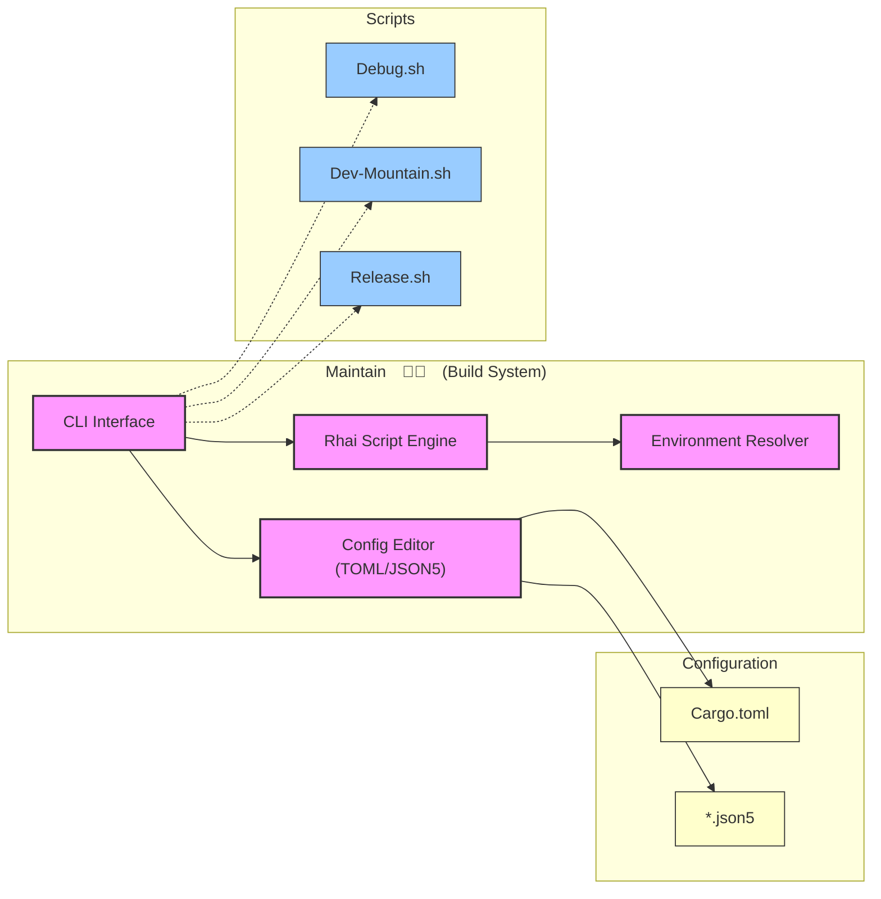

<table>
<tr>
<td align="left" valign="middle">
<h3 align="left">Maintain</h3>
</td>
<td align="left" valign="middle">
<h3 align="left">💪🏻</h3>
</td>
<td align="left" valign="middle">
<h3 align="left">+</h3>
</td>
<td align="left" valign="middle">
<h3 align="left">
<a href="https://Editor.Land" target="_blank">
<picture>
<source media="(prefers-color-scheme: dark)" srcset="https://PlayForm.Cloud/Dark/Image/GitHub/Land.svg">
<source media="(prefers-color-scheme: light)" srcset="https://PlayForm.Cloud/Image/GitHub/Land.svg">

</picture>
</a>
</h3>
</td>
<td align="left" valign="middle">
<h3 align="left">
<a href="https://Editor.Land" target="_blank">
Land
</a>
</h3>
</td>
<td align="left" valign="middle">
<h3 align="left">🏞️</h3>
</td>
</tr>
</table>

---

# **Maintain** 💪🏻 The Build System & CI/CD Toolkit for Land 🏞️

[](https://github.com/CodeEditorLand/Maintain/tree/Current/LICENSE)
[](https://crates.io/crates/Maintain)
[](https://www.rust-lang.org/)
[](https://rhai.rs/)

Welcome to **Maintain**, the Rust-based build system and CI/CD toolkit for the
**Land Code Editor** ecosystem. Maintain provides comprehensive build
orchestration, Rhai scripting capabilities, and configuration management for
TOML and JSON5 files.

**Maintain** is engineered to:

1. **Orchestrate Builds:** Provide a central build system for the entire Land
   ecosystem with configurable build groups.
2. **Enable Scripting:** Embed the Rhai scripting language for flexible build
   logic and custom automation.
3. **Manage Configuration:** Offer type-safe TOML and JSON5 editing capabilities
   for Cargo.toml and other configuration files.
4. **Provide CLI Interface:** Deliver a command-line interface for build
   operations with environment variable resolution.

---

## Key Features 🔐

- **Rhai Scripting Engine:** Embedded Rhai interpreter for flexible build
  configuration and custom automation logic.
- **Configuration Editing:** Type-safe TOML and JSON5 editing for Cargo.toml and
  other configuration files with validation.
- **Environment Resolution:** Dynamic environment variable handling with
  scriptable resolvers for build-time configuration.
- **CLI Interface:** Comprehensive command-line interface with subcommands for
  build, debug, release, and profile operations.
- **Build Orchestration:** Central coordination of multi-stage builds across the
  Land ecosystem.

---

## Core Architecture Principles 🏗️

| Principle                 | Description                                                                               | Key Components Involved                  |
| :------------------------ | :---------------------------------------------------------------------------------------- | :--------------------------------------- |
| **Scriptability**         | Enable flexible build logic through embedded Rhai scripting with full environment access. | `Rhai/ConfigLoader`, `Rhai/ScriptRunner` |
| **Type Safety**           | Provide compile-time checked configuration access with validation for TOML/JSON5.         | `toml_edit`, `json5` crates              |
| **Modularity**            | Separate concerns between CLI, scripting, and configuration editing components.           | `CLI.rs`, `Rhai/`, `Build/*`             |
| **Environment Awareness** | Dynamic resolution of environment variables for flexible build configurations.            | `EnvironmentResolver.rs`                 |

---

## `Maintain` in the Land Ecosystem 💪🏻 + 🏞️

| Component                 | Role & Key Responsibilities                                  |
| :------------------------ | :----------------------------------------------------------- |
| **Build Orchestrator**    | Central coordination of builds across all Land elements.     |
| **Scripting Host**        | Rhai engine for custom build logic and automation.           |
| **Configuration Manager** | TOML/JSON5 editing for Cargo.toml and project configuration. |
| **CLI Provider**          | Command-line interface for developers and CI/CD pipelines.   |

---

## Getting Started 🚀

### Installation

To add `Maintain` to your project:

```toml
[dependencies]
Maintain = { git = "https://github.com/CodeEditorLand/Maintain.git", branch = "Current" }
```

Or install the CLI:

```sh
cargo install Maintain
```

**Key Dependencies:**

- `rhai`: Embedded scripting engine
- `clap`: CLI argument parsing
- `toml_edit`: TOML parsing and editing
- `json5`: JSON5 configuration support
- `chrono`: Date/time handling
- `colored`: Colored terminal output

### Usage Pattern

`Maintain` is typically invoked through shell scripts:

```sh
# Debug build
./Maintain/Debug.sh

# Development mode for Mountain
./Maintain/Dev-Mountain.sh

# Release build
./Maintain/Release.sh
```

---

## Overview

## Overview

Maintain serves as the central build orchestration tool, offering:

- **Build System**: Comprehensive build configuration and execution
- **Rhai Scripting**: Embedded scripting for custom build logic
- **Configuration Management**: TOML and JSON5 editing capabilities
- **CLI Interface**: Command-line interface for build operations
- **Environment Resolution**: Dynamic environment variable handling

## Installation

```sh
cargo install Maintain
```

---

## System Architecture Diagram 🏗️

This diagram illustrates `Maintain`'s build orchestration architecture.



---

## Usage

### As Binary

```sh
# Run Maintain build system
Maintain [OPTIONS] [COMMAND]
```

### As Library

```rust
use maintain::Build;

let build = Build::new();
build.execute()?;
```

## Project Structure

```
Element/Maintain/
├── Source/
│   ├── Library.rs # Main entry point
│   └── Build/
│       ├── CLI.rs # Command-line interface
│       ├── Constant.rs # Build constants
│       ├── Definition.rs # Build definitions
│       ├── Fn.rs # Build functions
│       ├── Rhai/ # Rhai scripting engine
│       │   ├── ConfigLoader.rs
│       │   ├── EnvironmentResolver.rs
│       │   └── ScriptRunner.rs
│       └── ...
└── Debug/ # Debug scripts
    ├── All.sh
    ├── Build.sh
    ├── Run.sh
    └── Wind.sh
```

---

## Deep Dive & Component Breakdown 🔬

To understand how `Maintain`'s internal components interact to provide the build
orchestration functionality, see the following source files:

- **[`Source/Library.rs`](https://github.com/CodeEditorLand/Maintain/tree/Current/Source/Library.rs)** -
  Main entry point and module declarations
- **[`Source/Build/CLI.rs`](https://github.com/CodeEditorLand/Maintain/tree/Current/Source/Build/CLI.rs)** -
  Command-line interface with clap
- **[`Source/Build/Rhai/`](https://github.com/CodeEditorLand/Maintain/tree/Current/Source/Build/Rhai/)** -
  Rhai scripting engine integration
- [`ConfigLoader.rs`](https://github.com/CodeEditorLand/Maintain/tree/Current/Source/Build/Rhai/ConfigLoader.rs) -
  Configuration file loading
- [`EnvironmentResolver.rs`](https://github.com/CodeEditorLand/Maintain/tree/Current/Source/Build/Rhai/EnvironmentResolver.rs) -
  Environment variable resolution
- [`ScriptRunner.rs`](https://github.com/CodeEditorLand/Maintain/tree/Current/Source/Build/Rhai/ScriptRunner.rs) -
  Script execution engine

The source files explain the Rhai scripting integration, TOML/JSON5 editing
capabilities, and the build orchestration patterns.

---

## Shell Scripts

Maintain includes several helper scripts in the `Maintain/` directory:

- [`Debug.sh`](Debug.sh) - Debug mode execution
- [`Dev-Mountain.sh`](Dev-Mountain.sh) - Mountain development mode
- [`Profile.sh`](Profile.sh) - Performance profiling
- [`Release.sh`](Release.sh) - Release build

### Debug Subdirectory

The `Maintain/Debug/` directory contains additional debug scripts:

- [`All.sh`](Debug/All.sh) - Debug all components
- [`Build.sh`](Debug/Build.sh) - Debug build process
- [`Run.sh`](Debug/Run.sh) - Debug runtime
- [`Wind.sh`](Debug/Wind.sh) - Debug Wind component

## Features

### Rhai Scripting Support

Maintain embeds the Rhai scripting language for flexible build configuration:

- **ConfigLoader**: Load and parse Rhai configuration files
- **EnvironmentResolver**: Resolve environment variables in scripts
- **ScriptRunner**: Execute Rhai scripts in the build context

### Configuration Editing

- **TOML Editing**: Modify Cargo.toml and other TOML files
- **JSON5 Support**: Handle JSON5 configuration files
- **Type-safe Operations**: Compile-time checked configuration access

## Dependencies

- `clap` - CLI argument parsing
- `rhai` - Embedded scripting engine
- `toml` / `toml_edit` - TOML parsing and editing
- `json5` - JSON5 configuration support
- `chrono` - Date/time handling
- `colored` - Colored terminal output
- `log` / `env_logger` - Logging framework

## Development

### Building

```sh
cd Element/Maintain
cargo build --release
```

### Running Tests

```sh
cargo test
```

### Examples

See [`examples/`](examples/) directory for usage examples.

## Changelog

See [`CHANGELOG.md`](https://github.com/CodeEditorLand/Maintain/tree/Current/)
for a history of changes to this component.

## License ⚖️

This project is released into the public domain under the **Creative Commons CC0
Universal** license. You are free to use, modify, distribute, and build upon
this work for any purpose, without any restrictions. For the full legal text,
see the [`LICENSE`](https://github.com/CodeEditorLand/Maintain/tree/Current/)
file.

---

## Changelog 📜

Stay updated with our progress! See
[`CHANGELOG.md`](https://github.com/CodeEditorLand/Maintain/tree/Current/) for a
history of changes specific to **Maintain**.

---

## Funding & Acknowledgements 🙏🏻

**Maintain** is a core element of the **Land** ecosystem. This project is funded
through [NGI0 Commons Fund](https://NLnet.NL/commonsfund), a fund established by
[NLnet](https://NLnet.NL) with financial support from the European Commission's
[Next Generation Internet](https://ngi.eu) program. Learn more at the
[NLnet project page](https://NLnet.NL/project/Land).

<table>
	<thead>
		<tr>
			<th align="left"><strong>Land</strong></th>
			<th align="left"><strong>PlayForm</strong></th>
			<th align="left"><strong>NLnet</strong></th>
			<th align="left"><strong>NGI0 Commons Fund</strong></th>
		</tr>
	</thead>
	<tbody>
		<tr>
			<td align="left" valign="middle">
				<a href="https://Editor.Land">
					
				</a>
			</td>
			<td align="left" valign="middle">
				<a href="https://PlayForm.Cloud">
					
				</a>
			</td>
			<td align="left" valign="middle">
				<a href="https://NLnet.NL">
					
				</a>
			</td>
			<td align="left" valign="middle">
				<a href="https://NLnet.NL/commonsfund">
					
				</a>
			</td>
		</tr>
	</tbody>
</table>

---

**Project Maintainers**: Source Open
([Source/Open@Editor.Land](mailto:Source/Open@Editor.Land)) |
[GitHub Repository](https://github.com/CodeEditorLand/Maintain) |
[Report an Issue](https://github.com/CodeEditorLand/Maintain/issues) |
[Security Policy](https://github.com/CodeEditorLand/Maintain/security/policy)
