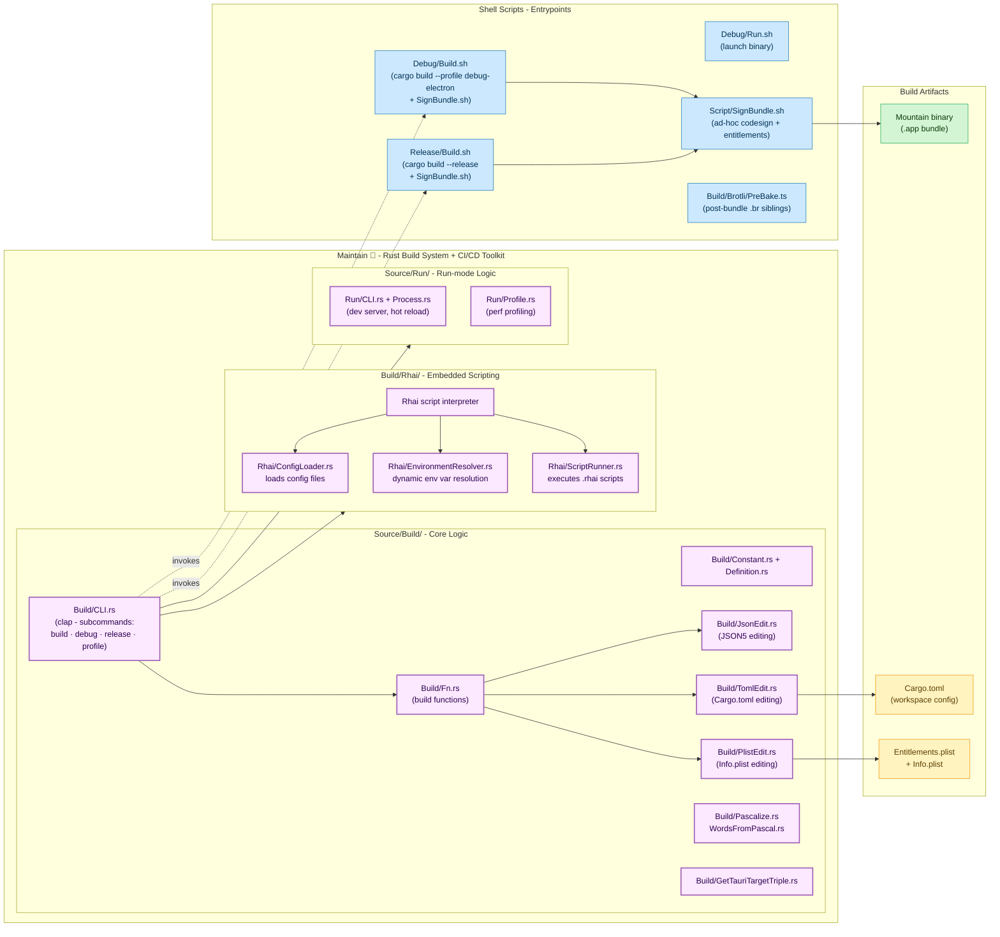

# **Maintain**&#x2001;🔧

<table>
	<tr>
		<td>
			<a href="https://GitHub.Com/CodeEditorLand/Maintain" target="_blank">
				<picture>
					<source media="(prefers-color-scheme: dark)" srcset="https://img.shields.io/github/last-commit/CodeEditorLand/Maintain?label=Last-commit&color=black&labelColor=black&logoColor=white&logoWidth=0" />
					<source media="(prefers-color-scheme: light)" srcset="https://img.shields.io/github/last-commit/CodeEditorLand/Maintain?label=Last-commit&color=white&labelColor=white&logoColor=black&logoWidth=0" />
					
				</picture>
			</a>
			<br />
			<a href="https://GitHub.Com/CodeEditorLand/Maintain" target="_blank">
				<picture>
					<source media="(prefers-color-scheme: dark)" srcset="https://img.shields.io/github/issues/CodeEditorLand/Maintain?label=Issues&color=black&labelColor=black&logoColor=white&logoWidth=0" />
					<source media="(prefers-color-scheme: light)" srcset="https://img.shields.io/github/issues/CodeEditorLand/Maintain?label=Issues&color=white&labelColor=white&logoColor=black&logoWidth=0" />
					
				</picture>
			</a>
		</td>
		<td>
			<a href="https://github.com/CodeEditorLand/Maintain" target="_blank">
				<picture>
					<source media="(prefers-color-scheme: dark)" srcset="https://img.shields.io/github/stars/CodeEditorLand/Maintain?style=flat&label=Star&logo=github&color=black&labelColor=black&logoColor=white&logoWidth=0" />
					<source media="(prefers-color-scheme: light)" srcset="https://img.shields.io/github/stars/CodeEditorLand/Maintain?style=flat&label=Star&logo=github&color=white&labelColor=white&logoColor=black&logoWidth=0" />
					
				</picture>
			</a>
			<br />
			<a href="https://GitHub.Com/CodeEditorLand/Maintain" target="_blank">
				<picture>
					<source media="(prefers-color-scheme: dark)" srcset="https://img.shields.io/github/downloads/CodeEditorLand/Maintain?label=Downloads&color=black&labelColor=black&logoColor=white&logoWidth=0" />
					<source media="(prefers-color-scheme: light)" srcset="https://img.shields.io/github/downloads/CodeEditorLand/Maintain?label=Downloads&color=white&labelColor=white&logoColor=black&logoWidth=0" />
					
				</picture>
			</a>
		</td>
	</tr>
</table>

The Build System & CI/CD Toolkit for Land 🏞️

[](https://github.com/CodeEditorLand/Maintain/blob/Current/LICENSE)
[](https://www.rust-lang.org/)
[](https://crates.io/crates/Maintain)
[](https://www.rust-lang.org/)
[](https://www.rust-lang.org/)
[](https://rhai.rs/)

**[Rust API Documentation](https://Rust.Documentation.editor.land/Maintain/)**

---

## Overview

Maintain is the Rust-based build system and CI/CD toolkit for the Land Code
Editor ecosystem. It provides comprehensive build orchestration, Rhai scripting
capabilities, and configuration management for TOML and JSON5 files. Build
pipelines that change behavior based on environment variables, implicit tool
versions, or undeclared dependencies make debugging production issues impossible

- the same commit produces different output on different machines. Maintain
  ensures deterministic builds: same commit, same output, guaranteed.

**Maintain is engineered to:**

1. **Orchestrate Builds:** Provide a central build system for the entire Land
   ecosystem with configurable build groups.
2. **Enable Scripting:** Embed the Rhai scripting language for flexible build
   logic and custom automation.
3. **Manage Configuration:** Offer type-safe TOML and JSON5 editing capabilities
   for Cargo.toml and other configuration files.
4. **Provide CLI Interface:** Deliver a command-line interface for build
   operations with environment variable resolution.

## Architecture



## Key Components

| Component          | Path                                               | Description                                                                    |
| ------------------ | -------------------------------------------------- | ------------------------------------------------------------------------------ |
| Library (Entry)    | `Source/Library.rs`                                | Main entry point and module declarations                                       |
| CLI                | `Source/Build/CLI.rs`                              | Command-line interface with clap (subcommands: build, debug, release, profile) |
| Build Functions    | `Source/Build/Fn.rs`                               | Build functions                                                                |
| Constants          | `Source/Build/Constant.rs`                         | Build constants                                                                |
| Definitions        | `Source/Build/Definition.rs`                       | Build definitions                                                              |
| JSON5 Editor       | `Source/Build/JsonEdit.rs`                         | JSON5 configuration editing                                                    |
| TOML Editor        | `Source/Build/TomlEdit.rs`                         | Cargo.toml editing                                                             |
| Plist Editor       | `Source/Build/PlistEdit.rs`                        | Info.plist editing                                                             |
| Pascalize          | `Source/Build/Pascalize.rs` / `WordsFromPascal.rs` | String conversion utilities                                                    |
| Get Triple         | `Source/Build/GetTauriTargetTriple.rs`             | Target triple resolution                                                       |
| Rhai Config Loader | `Source/Build/Rhai/ConfigLoader.rs`                | Configuration file loading                                                     |
| Rhai Env Resolver  | `Source/Build/Rhai/EnvironmentResolver.rs`         | Dynamic environment variable resolution                                        |
| Rhai Script Runner | `Source/Build/Rhai/ScriptRunner.rs`                | Script execution engine                                                        |
| Run CLI            | `Source/Run/CLI.rs`                                | Dev server, hot reload                                                         |
| Run Process        | `Source/Run/Process.rs`                            | Process management                                                             |
| Profile            | `Source/Run/Profile.rs`                            | Performance profiling                                                          |

## In the Land Project

Maintain orchestrates builds across all Land elements. Its CLI invokes shell
scripts (Debug/Build.sh, Release/Build.sh) which compile the Mountain binary
with code signing and entitlements. The Rhai engine enables custom build
automation scripts. Configuration editors modify Cargo.toml (version bumps,
dependency updates), JSON5 configs, and Info.plist/Entitlements.plist files.
Maintain resolves environment variables dynamically for build-time
configuration.

**Architecture Principles:** Scriptability (embedded Rhai scripting with full
environment access), Type Safety (compile-time checked config with
`toml_edit`/`json5`), Modularity (separate CLI, scripting, and config editing),
Environment Awareness (dynamic resolution of environment variables).

### Project Structure

```
Element/Maintain/
├── Source/
│   ├── Library.rs       # Main entry point
│   └── Build/
│       ├── CLI.rs        # Command-line interface with clap
│       ├── Constant.rs   # Build constants
│       ├── Definition.rs # Build definitions
│       ├── Fn.rs         # Build functions
│       ├── Rhai/         # Rhai scripting engine
│       │   ├── ConfigLoader.rs
│       │   ├── EnvironmentResolver.rs
│       │   └── ScriptRunner.rs
│       └── ...
├── Debug/                # Debug scripts
│   ├── All.sh
│   ├── Build.sh
│   ├── Run.sh
│   └── Wind.sh
├── Release/              # Release scripts
├── Script/               # Shared scripts (SignBundle.sh, etc.)
├── Build/
│   ├── Brotli/           # Brotli compression for bundles
│   └── ...
├── Debug.sh              # Debug mode execution
├── Dev-Mountain.sh       # Mountain development mode
├── Profile.sh            # Performance profiling
└── Release.sh            # Release build
```

### Key Features

- **Rhai Scripting Engine:** Embedded Rhai interpreter for flexible build
  configuration and custom automation logic.
- **Configuration Editing:** Type-safe TOML and JSON5 editing for Cargo.toml and
  other configuration files with validation.
- **Environment Resolution:** Dynamic environment variable handling with
  scriptable resolvers for build-time configuration.
- **CLI Interface:** Comprehensive command-line interface with subcommands for
  build, debug, release, and profile operations.
- **Build Orchestration:** Central coordination of multi-stage builds across the
  Land ecosystem.

## Getting Started

### Installation

To add `Maintain` as a dependency:

```toml
[dependencies]
Maintain = { git = "https://github.com/CodeEditorLand/Maintain.git", branch = "Current" }
```

Or install the CLI globally:

```sh
cargo install Maintain
```

### Key Dependencies

- `rhai`: Embedded scripting engine
- `clap`: CLI argument parsing
- `toml_edit`: TOML parsing and editing
- `json5`: JSON5 configuration support
- `chrono`: Date/time handling
- `colored`: Colored terminal output
- `log` / `env_logger`: Logging framework

### Usage Pattern

`Maintain` is typically invoked through its included shell scripts:

```sh
# Debug build
./Maintain/Debug.sh

# Development mode for Mountain
./Maintain/Dev-Mountain.sh

# Release build
./Maintain/Release.sh
```

As a binary:

```sh
Maintain [OPTIONS] [COMMAND]
```

As a library:

```rust
use Maintain::Build;

let Build = Build::new();
Build.execute()?;
```

## API Reference

- [Rust API Documentation](https://Rust.Documentation.editor.land/Maintain/)

## Related Documentation

- [Architecture Overview](https://Editor.Land/Doc/architecture)
- [Why Rust](https://Editor.Land/Doc/why-rust)
- [Mountain](https://github.com/CodeEditorLand/Mountain) - Native desktop shell
- [Rest](https://github.com/CodeEditorLand/Rest) - TypeScript compiler
- [Output](https://github.com/CodeEditorLand/Output) - Build artifact pipeline

---

## Funding

This project is funded through
[NGI0 Commons Fund](https://NLnet.NL/commonsfund), a fund established by
[NLnet](https://NLnet.NL) with financial support from the European Commission's
Next Generation Internet program, under grant agreement No 101135429.

The project is operated by PlayForm, based in Sofia, Bulgaria. PlayForm acts as
the open-source steward for Code Editor Land under the NGI0 Commons Fund grant.

<table>
	<tbody>
		<tr>
			<td align="left" valign="middle">
				<a href="https://Editor.Land">
					
				</a>
			</td>
			<td align="left" valign="middle">
				<a href="https://PlayForm.Cloud">
					
				</a>
			</td>
			<td align="left" valign="middle">
				<a href="https://NLnet.NL">
					
				</a>
			</td>
			<td align="left" valign="middle">
				<a href="https://NLnet.NL/commonsfund">
					
				</a>
			</td>
		</tr>
	</tbody>
</table>
